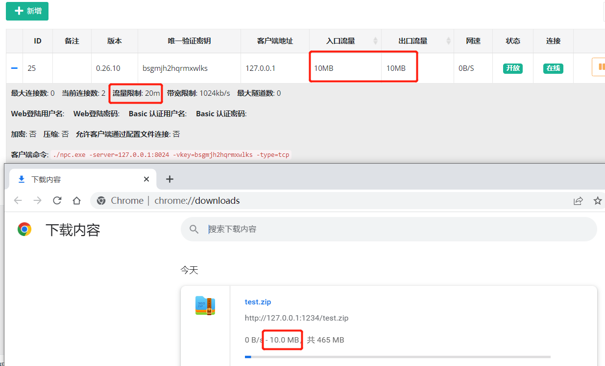

# nps
   
[](https://gitter.im/cnlh-nps/community?utm_source=badge&utm_medium=badge&utm_campaign=pr-badge)


[README](https://github.com/dreamskr/nps/blob/master/README_EN.md)|[中文文档](https://github.com/dreamskr/nps/blob/master/README.md)

nps是一款轻量级、高性能、功能强大的**内网穿透**代理服务器。目前支持**tcp、udp流量转发**，可支持任何**tcp、udp**上层协议（访问内网网站、本地支付接口调试、ssh访问、远程桌面，内网dns解析等等……），此外还**支持内网http代理、内网socks5代理**、**p2p等**，并带有功能强大的web管理端。


## 一、背景


1. 做微信公众号开发、小程序开发等----> 域名代理模式

2. 想在外网通过ssh连接内网的机器，做云服务器到内网服务器端口的映射，----> tcp代理模式

3. 在非内网环境下使用内网dns，或者需要通过udp访问内网机器等----> udp代理模式

4. 在外网使用HTTP代理访问内网站点----> http代理模式

5. 搭建一个内网穿透ss，在外网如同使用内网vpn一样访问内网资源或者设备----> socks5代理模式
## 二、特点
- 协议支持全面，兼容几乎所有常用协议，例如tcp、udp、http(s)、socks5、p2p、http代理...
- 全平台兼容(linux、windows、macos、群辉、OpenWrt等)，支持一键安装为系统服务
- 控制全面，同时支持服务端和客户端控制
- https集成，支持将后端代理和web服务转成https，同时支持多证书
- 操作简单，只需简单的配置即可在web ui上完成其余操作
- 展示信息全面，流量、系统信息、即时带宽、客户端版本等
- 扩展功能强大，该有的都有了（缓存、压缩、加密、流量限制、带宽限制、端口复用等等）
- 域名解析具备自定义header、404页面配置、host修改、站点保护、URL路由、泛解析等功能
- 服务端支持多用户和用户注册功能

**没找到你想要的功能？不要紧，点击[进入文档](https://dreamskr.github.io/nps)查找吧**
## 三、快速开始

#### 1.安装
>  通过[Releases](https://github.com/dreamskr/nps/releases)下载对应的版本

下载对应的系统版本即可，服务端和客户端是单独的

#### 2.服务端启动
下载完服务器压缩包后，解压，然后进入解压后的文件夹

- 执行安装命令
	* 对于linux|darwin ```sudo ./nps install```
	* 对于windows，管理员身份运行cmd，进入安装目录 ```nps.exe install```

- 默认端口
	* nps默认配置文件使用了80，443，9000，9001端口
	* 80与443端口为域名解析模式默认端口,默认关闭
	* 9000为web管理访问端口
	* 9001为网桥端口，用于客户端与服务器通信

- 启动
	* 对于linux|darwin ```sudo nps start```
	* 对于windows，管理员身份运行cmd，进入程序目录 ```nps.exe start```

- 注意
	* nps支持以下命令参数：```start,stop,restart,install,uninstall```
	* 如果发现没有启动成功，查看日志(Windows日志文件位于当前运行目录下，linux和darwin位于/var/log/nps.log)

#### 3.客户端连接
- 仅运行客户
	* 点击web管理中客户端前的+号，复制**客户端运行命令**的命令行
	* 执行命令，linux直接执行即可，windows将./npc换成npc.exe用cmd执行

- 注册到系统服务
	* 点击web管理中客户端前的+号，复制**注册到系统服务**的命令行
	* 执行命令，linux直接执行即可，windows将./npc换成npc.exe用cmd执行
	* 执行```npc start```即可
	* npc支持以下命令参数：```start,stop,restart,install,uninstall```

#### 4.配置
- 客户端连接后，在web中配置对应穿透服务即可
- 更多高级用法见[完整文档](https://dreamskr.github.io/nps)

## 四、贡献
- 如果遇到bug可以直接提交至dev分支
- 使用遇到问题可以通过issues反馈
- 项目处于开发阶段，还有很多待完善的地方，如果可以贡献代码，请提交 PR 至 dev 分支
- 如果有新的功能特性反馈，可以通过issues或者qq群反馈

## 五、更新日志(于2024-12-22 基于[yisier/nps](https://github.com/yisier/nps)的v0.26.20版本修改)
- 1.调用新增修改客户端、隧道、域名的API，返回当前新增或修改后的记录json。
- 2.修改默认日志级别为4。关闭默认http及https默认端口。修改默认端口为9000。默认打开允许本地代理。
- 3.增加展开客户端时，显示安装或注册系统服务的命令。
- 4.修改以服务方式安装nps和npc的服务名及显示名称（因特殊场景需要，改了服务名及名称，可Fork回去自行修改）。
- 5.管理域名和隧道时，客户端ID改成下拉列表选择。


- 2024-11-07  v0.26.20  
  新增：
  - 客户端增加创建时间
  
  修复：
  - 客户端限速单位不统一 [#185](https://github.com/yisier/nps/issues/185)
  - 增加从下拉选择客户端,隧道列表排序,新增编辑后不会刷新界面 [#183](https://github.com/yisier/nps/issues/183)
  - 隧道数量限制无法统计域名映射 [#209](https://github.com/yisier/nps/issues/209) 
  

- 2024-06-01  v0.26.19  
  - golang 版本升级到 1.22.
  - 增加自动https，自动将http 重定向（301）到 https.  
  - 客户端命令行方式启动支持多个隧道ID，使用逗号拼接，示例：`npc -server=xxx:8024 -vkey=ytkpyr0er676m0r7,iwnbjfbvygvzyzzt` .
  - 移除 nps.conf 参数 `https_just_proxy` , 调整 https 处理逻辑，如果上传了 https 证书，则由nps负责SSL (此方式可以获取真实IP)，
      否则走端口转发模式（使用本地证书,nps 获取不到真实IP）， 如下图所示。    
    


- 2024-02-27  v0.26.18  
  ***新增***：nps.conf 新增 `tls_bridge_port=8025` 参数，当 `tls_enable=true` 时，nps 会监听8025端口，作为 tls 的连接端口。  
             客户端可以选择连接 tls 端口或者非 tls 端口： `npc.exe  -server=xxx:8024 -vkey=xxx` 或 `npc.exe  -server=xxx:8025 -vkey=xxx -tls_enable=true`
  
  
- 2024-01-31  v0.26.17  
  ***说明***：考虑到 npc 历史版本客户端众多，版本号不同旧版本客户端无法连接，为了兼容，仓库版本号将继续沿用 0.26.xx


- 2024-01-02  v0.27.01  (已作废，功能移动到v0.26.17 版本)  
  ***新增***：tls 流量加密，(客户端忽略证书校验，谨慎使用，客户端与服务端需要同时开启，或同时关闭)，使用方式：   
             服务端：nps.conf `tls_enable=true`;    
             客户端：npc.conf `tls_enable=true` 或者 `npc.exe  -server=xxx -vkey=xxx -tls_enable=true`  

  
- 2023-06-01  v0.26.16  
  ***修复***：https 流量不统计 Bug 修复。  
  ***新增***：新增全局黑名单IP，用于防止被肉鸡扫描端口或被恶意攻击。  
  ***新增***：新增客户端上次在线时间。


- 2023-02-24  v0.26.15  
  ***修复***：更新程序 url 更改到当前仓库中   
  ***修复***：nps 在外部路径启动时找不到配置文件  
  ***新增***：增加 nps 启动参数，`-conf_path=D:\test\nps`,可用于加载指定nps配置文件和web文件目录。  
  ***window 使用示例：***  
  直接启动：`nps.exe -conf_path=D:\test\nps`  
  安装：`nps.exe install -conf_path=D:\test\nps`    
  安装启动：`nps.exe start`      

  ***linux 使用示例：***    
  直接启动：`./nps -conf_path=/app/nps`  
  安装：`./nps install -conf_path=/app/nps`  
  安装启动：`nps start -conf_path=/app/nps`  


- 2022-12-30  v0.26.14  
  ***修复***：API 鉴权漏洞修复


- 2022-12-19  
***修复***：某些场景下丢包导致服务端意外退出  
***优化***：新增隧道时，不指定服务端口时，将自动生成端口号  
***优化***：API返回ID, `/client/add/, /index/addhost/，/index/add/ `   
***优化***：域名解析、隧道页面，增加[唯一验证密钥]，方便搜查  


- 2022-10-30   
***新增***：在管理面板中新增客户端时，可以配置多个黑名单IP，用于防止被肉鸡扫描端口或被恶意攻击。  
***优化***：0.26.12 版本还原了注册系统功能，使用方式和以前一样。无论是否注册了系统服务，直接执行 nps 时只会读取当前目录下的配置文件。


- 2022-10-27  
***新增***：在管理面板登录时开启验证码校验，开启方式：nps.conf `open_captcha=true`，感谢 [@dongFangTuring](https://github.com/dongFangTuring) 提供的PR  

  
- 2022-10-24:     
***修复***：HTTP协议支持WebSocket(稳定性待测试)
  

- 2022-10-21:   
***修复***：HTTP协议下实时统计流量，能够精准的限制住流量（上下行对等）  
***优化***：删除HTTP隧道时，客户端已用流量不再清空


- 2022-10-19:  
***BUG***：在TCP协议下，流量统计有问题，只有当连接断开时才会统计流量。例如，限制客户端流量20m,当传输100m的文件时，也能传输成功。  
***修复***：TCP协议下实时统计流量，能够精准的限制住流量（上下行对等）  
***优化***：删除TCP隧道时，客户端已用流量不再清空



- 2022-09-14:  
修改NPS工作目录为当前可执行文件目录（即配置文件和nps可执行文件放在同一目录下，直接执行nps文件即可），去除注册系统服务，启动、停止、升级等命令